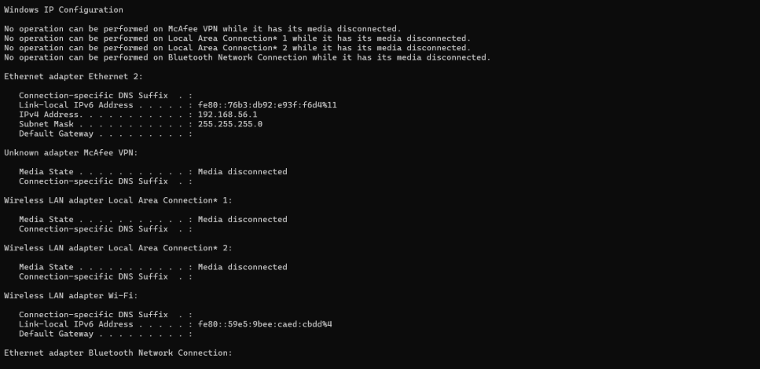
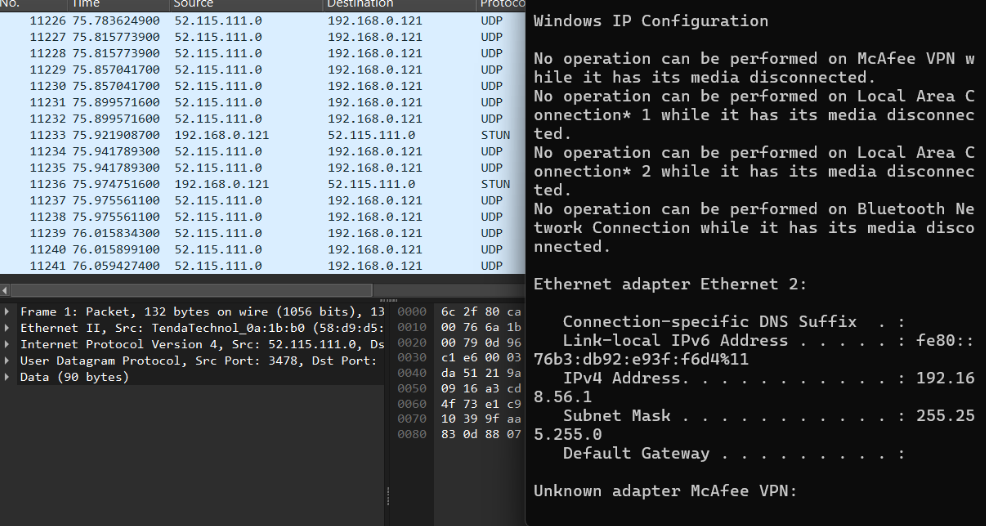
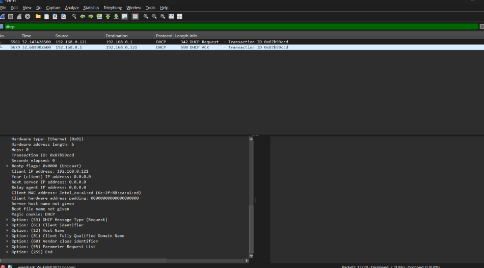

## Laporan Praktikum Jarkom

# Langkah Percobaan
1. 11.1

# Lampiran
1. Melepaskan Alamat IP dari Client

2. Menjalankan Wireshark
Setelah alamat IP dilepaskan, aplikasi Wireshark dijalankan dan dipilih interface jaringan yang sedang aktif. Selanjutnya proses packet capture dimulai agar seluruh lalu lintas jaringan dapat direkam.
Pada tahap ini Wireshark akan menangkap paket DHCP yang dikirimkan oleh client maupun server selama proses permintaan alamat IP berlangsung.

3. Meminta Alamat IP Baru

4. Menghentikan Capture dan Menganalisis Paket

