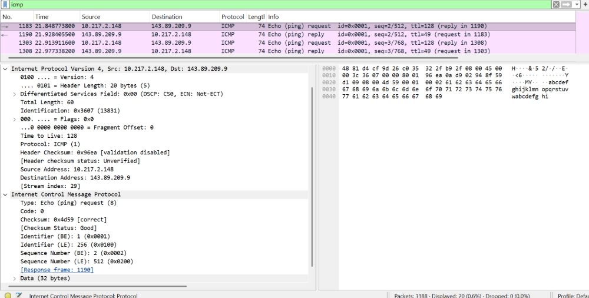
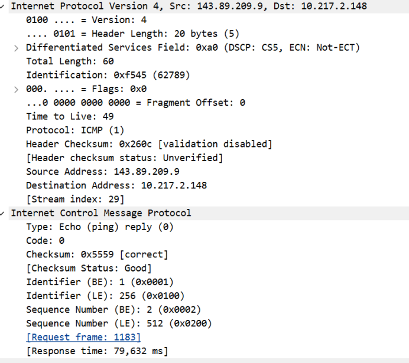
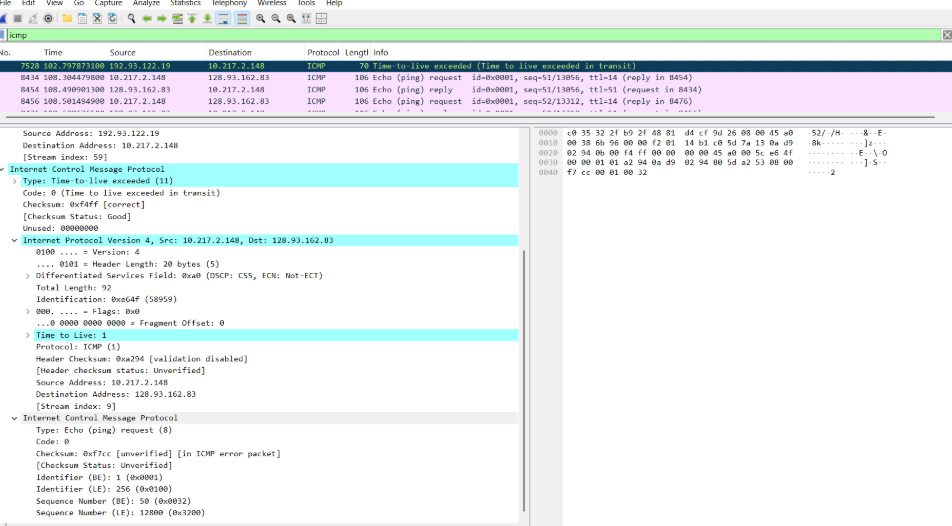

## Laporan Praktikum Jarkom

# Langkah Percobaan
1. 12.1

# Lampiran

# Soal 4.1
1. Output Command Prompt - Ping

2. Analisis Paket ICMP Ping di Wireshark

Detail Paket ICMP Echo Request

Detail Paket ICMP Echo Reply

3. Output Command Prompt - Traceroute

4. Analisis Paket ICMP Traceroute di Wireshark

Detail Paket ICMP Time Exceeded

